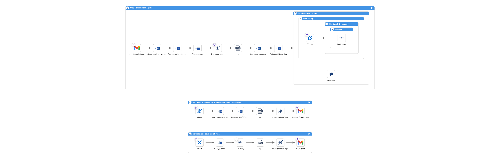

Recent Camel releases introduced several features that work well together for AI-powered integrations: the `camel-openai` component (4.17), the `SimpleFunction` interface, chain operator, and structured output with JSON Schema (4.18), and Gmail DataType Transformers (4.19).

I built an email triage agent that classifies Gmail messages using an LLM, moves them to labels, and drafts smart replies. The whole thing runs with Camel JBang. No Maven project, no framework setup.

## Overview

The agent polls Gmail for unread emails, sends each one to OpenAI for classification, moves it to a matching Gmail label, and optionally drafts a reply. Six categories: `URGENT`, `ACTION_REQUIRED`, `INFORMATIONAL`, `SECURITY_ALERT`, `PURCHASE`, `SHIPPING`.

Three Camel routes handle the full flow. Here is what they look like in <a href="https://kaoto.io/" target="_blank">Kaoto</a>:



Let's walk through each route.

## Route 1: The Main Agent

The main route polls Gmail, sanitizes the email, classifies it with OpenAI, and decides what to do next.

```yaml
- route:
    id: triage-email-main-agent
    from:
      uri: google-mail-stream:0
      parameters:
        applicationName: camel-email-triage
        delay: "10000"
        markAsRead: "false"
        query: is:unread in:inbox
```

The `google-mail-stream` consumer fetches unread emails every 10 seconds. It exposes the email subject and sender as Camel headers, and the body as the message body.

### Sanitization with SimpleFunction

Raw emails contain HTML, tracking pixels, and URLs with thousands of encoded parameters. Sending all of that to an LLM is a problem. During testing, a marketing email with massive tracking URLs caused the model to interpret URL content as additional instructions. Instead of returning JSON, it responded with "Do you want me to do anything else with this information?" Classic indirect prompt injection.

Camel 4.18 introduced the `SimpleFunction` interface to plug custom functions into Simple expressions. The agent uses one with <a href="https://jsoup.org/" target="_blank">Jsoup</a> to strip HTML tags and URLs before anything reaches the LLM:

```java
@BindToRegistry("html-decode-function")
public class HtmlDecodeFunction implements SimpleFunction {

    @Override
    public String getName() {
        return "htmlDecode";
    }

    @Override
    public Object apply(Exchange exchange, Object input) throws Exception {
        String text = Jsoup.parse(input.toString()).text();
        ...
    }
}
```

The route chains it using the `~>` operator (also 4.18) to pipe the body and subject through the sanitizer:

```yaml
      steps:
        - setVariable:
            name: cleanedEmailBody
            simple:
              expression: $\{body} ~> $\{htmlDecode()}
        - setVariable:
            name: cleanedSubject
            simple:
              expression: $\{header.CamelGoogleMailStreamSubject} ~> $\{htmlDecode()}
```

No separate processor, no extra route step. One expression.

### Classification with camel-openai and Structured Output

The `camel-openai` component (Camel 4.17) provides native integration with OpenAI and OpenAI-compatible APIs. It uses the official <a href="https://github.com/openai/openai-java" target="_blank">openai-java SDK</a> and supports chat completion, structured output, streaming, conversation memory, and multi-modal input.

The route sends the cleaned email to OpenAI. The prompt is minimal: just "classify the following email" and the email content. All the classification logic lives in the JSON schema:

```yaml
        - setBody:
            simple: "Classify the following email. From: $\{header.CamelGoogleMailStreamFrom} Subject: $\{variable.cleanedSubject} Body: --- $\{variable.cleanedEmailBody} ---"
        - to:
            uri: openai:chat-completion
            parameters:
              jsonSchema: "resource:classpath:email-triage-result.schema.json"
```

The `jsonSchema` parameter uses OpenAI <a href="https://platform.openai.com/docs/guides/structured-outputs" target="_blank">Structured Outputs</a>: the model is constrained to produce JSON that matches the provided schema. The schema defines the output structure, valid categories, and rules:

```json
{
    "type": "object",
    "properties": {
        "rationale": {
            "type": "string",
            "description": "Step-by-step reasoning. First, identify the email's core intent. Second, check for urgency signals. Third, choose the category that best matches."
        },
        "category": {
            "type": "string",
            "enum": [
                "URGENT",
                "ACTION_REQUIRED",
                "INFORMATIONAL",
                "SECURITY_ALERT",
                "PURCHASE",
                "SHIPPING"
            ]
        },
        "needsReply": {
            "type": "boolean",
            "description": "True ONLY if a real person is directly asking the recipient something that should be answered by email."
        }
    },
    "required": ["rationale", "category", "needsReply"],
    "additionalProperties": false
}
```

The `rationale` field comes first, forcing the model to analyze the email before choosing a category. Instead of relying on an external thinking mode, the model reasons inside the JSON itself. The `enum` constrains the output to valid values. The prompt stays minimal, the schema handles everything.

The LLM returns a JSON object. JSONPath extracts the fields into variables:

```yaml
        - setVariable:
            name: triageCategory
            jsonpath:
              expression: $.category
        - setVariable:
            name: triageNeedsReply
            jsonpath:
              expression: $.needsReply
```

### Routing Decisions

A Choice EIP validates the category and decides whether to draft a reply:

```yaml
        - choice:
            when:
              - simple:
                  expression: $\{variable.triageCategory} in 'URGENT,ACTION_REQUIRED,INFORMATIONAL,SECURITY_ALERT,PURCHASE,SHIPPING'
                steps:
                  - to:
                      uri: direct:handle-triaged-email
                  - choice:
                      when:
                        - simple:
                            expression: $\{variable.triageNeedsReply} == true
                          steps:
                            - wireTap:
                                uri: direct:draft-reply
```

The Wire Tap fires off reply generation asynchronously. The label update happens immediately. The draft shows up a few seconds later.

## Route 2: Gmail Label Management with DataType Transformers

Camel 4.19 introduces DataType Transformers for the Gmail component. No more manually constructing Gmail API request objects.

The label route sets two variables and lets the transformer build the `ModifyMessageRequest`:

```yaml
- route:
    id: handle-triaged-email
    from:
      uri: direct:handle-triaged-email
      steps:
        - setVariable:
            name: addLabels
            simple: $\{variable.triageCategory}
        - setVariable:
            name: removeLabels
            constant: INBOX
        - transformDataType:
            toType: google-mail:update-message-labels
        - to:
            uri: google-mail:messages/modify
            parameters:
              inBody: modifyMessageRequest
              applicationName: camel-email-triage
              userId: me
```

No Java code. The transformer reads `addLabels` and `removeLabels` from exchange variables and builds the API request automatically.

## Route 3: Drafting Replies

The reply route sends the email to OpenAI with a reply prompt, then uses the `google-mail:draft` transformer to construct a proper `Draft` object with email headers (`In-Reply-To`, `References`, `To`, `Subject`):

```yaml
- route:
    id: draft-reply
    from:
      uri: direct:draft-reply
      steps:
        - setBody:
            simple: "Draft a short, professional email reply (under 100 words). Output ONLY the reply body text. Do NOT fabricate information. From: $\{header.CamelGoogleMailStreamFrom} Subject: $\{variable.cleanedSubject} Body: $\{variable.cleanedEmailBody}"
        - to:
            uri: openai:chat-completion
        - transformDataType:
            toType: google-mail:draft
        - to:
            uri: google-mail:drafts/create
            parameters:
              inBody: content
              applicationName: camel-email-triage
              userId: me
```

The draft is saved in Gmail. You review it before sending.

## Model Choice

The default model is OpenAI GPT-5. You can change it in `application.properties`. The `camel-openai` component works with any OpenAI-compatible API via the `baseUrl` parameter. To use a local LLM:

```properties
camel.component.openai.model=your-model
camel.component.openai.baseUrl=http://localhost:11434/v1
camel.component.openai.apiKey=ollama
```

A local LLM variant using Gemma 4 via Ollama is included in the `local-llm/` directory. It uses a system prompt and few-shot examples to work around limitations of small models with structured output on Ollama.

## Running with Camel JBang

The entire agent is a set of YAML routes, one Java file, and a JSON schema. External dependencies like Jsoup are declared in `application.properties`, so Camel JBang runs it with:

```bash
camel run *
```

Before running, you need Gmail OAuth2 credentials and an OpenAI API key configured in `application.properties`. You also need to create six Gmail labels matching the categories. Full setup guide is in the project README.

## Camel Features Recap

This agent brings together features from three recent Camel releases:

- **Camel 4.17**: `camel-openai` component for LLM chat completion
- **Camel 4.18**: `SimpleFunction` interface for custom expression functions, and the `~>` chain operator
- **Camel 4.18**: `camel-openai` structured output with `jsonSchema` parameter
- **Camel 4.19**: Gmail DataType Transformers (`google-mail:update-message-labels`, `google-mail:draft`)
- **Camel JBang**: Run YAML routes and Java files directly, no build config needed
- **Wire Tap EIP**: Async reply drafting without blocking label updates

## Source Code

The full example is on <a href="https://github.com/zbendhiba/camel-ai-samples/tree/main/email-triage-agent" target="_blank">GitHub</a>.

---

*Originally published on the <a href="https://camel.apache.org/blog/2026/04/email-triage-agent/" target="_blank">Apache Camel blog</a>.*
