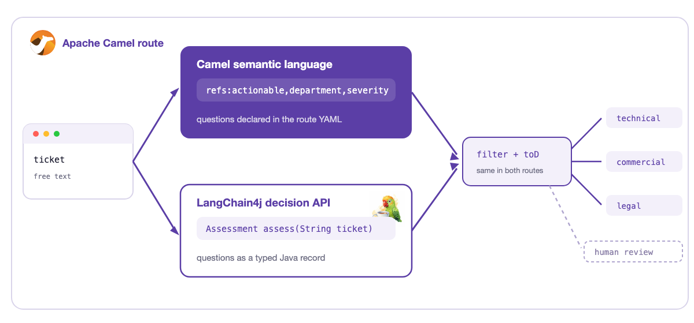

Getting a typed answer out of an LLM is a solved problem. JSON Schema, enums, structured output: I built an [email triage agent](/posts/apache-camel-ai-building-an-email-triage-agent-with-openai-gmail-transformers-and-camel-jbang/) exactly that way.

But structured output answers the wrong question. It guarantees the *shape*. It says nothing about whether the answer is *right*, or how sure the model is. An LLM fills your schema with a confident wrong label, and nothing tells you it guessed. Ask it to add a confidence field and you get a made-up number. Valid structure, wrong decision, no signal.

That gap is what <a href="https://docs.typesafe.ai/concepts/system-one" target="_blank">**System One models**</a> attack. And since <a href="https://camel.apache.org/blog/2026/09/semantic-evaluation-system-one/" target="_blank">Apache Camel</a> and <a href="https://docs.langchain4j.dev/tutorials/decision-services" target="_blank">LangChain4j</a> got support for them the same month, in different shapes, I built the same ticket triage twice and measured what differs. The code is on <a href="https://github.com/zbendhiba/camel-jev-routing" target="_blank">GitHub</a>.

## What is a System One model?

<a href="https://typesafe.ai" target="_blank">TypeSafe AI</a> launched **Jev** on September 15, 2026, and called it the first <a href="https://docs.typesafe.ai/concepts/system-one" target="_blank">System One model</a>: a model built to make fast, bounded judgments, not to generate text. You send it some state and a list of closed questions. It returns one typed answer per question, with probabilities, in a single forward pass. Around 100 milliseconds, no tokens generated at all.

The part that matters is **calibration**. The model is trained so the probabilities mean something: an answer at 0.8 is right about 80% of the time. That is the signal structured output never gives you. Your code can finally say "below this, a human decides" and trust the number.

Three primitives cover the question types, and the full API is in the <a href="https://docs.typesafe.ai" target="_blank">TypeSafe AI docs</a>:

| Primitive | Returns | Used here for |
|---|---|---|
| <a href="https://docs.typesafe.ai/primitives/noul" target="_blank">Noul</a> | a calibrated yes/no probability | is this actionable? |
| <a href="https://docs.typesafe.ai/primitives/choice" target="_blank">Choice</a> | one of the labels you declared, with probabilities | which team? |
| <a href="https://docs.typesafe.ai/primitives/score" target="_blank">Score</a> | a position on an ordered rubric | how severe? |

## The demo

A ticket comes in. The model answers the three questions in one call:

```
POST /ticket ──> one model call ──> actionable < 0.5 ? ──> human review
                                          │
                                          └──> technical / commercial / legal  (+ severity 0..2)
```

Locally I use <a href="https://ollama.com/library/tev1" target="_blank">**Tev1**</a>: an open 4B decision model from Together AI, fine-tuned from Qwen3.5 for exactly this kind of bounded judgment. It speaks the same wire protocol as Jev, and Ollama serves it natively at `/v1/systemone` since 0.35. Runs on a laptop, no API key. Switching to Jev is three properties. More models, hosted and open, are listed at <a href="https://systemonemodels.org/models/" target="_blank">systemonemodels.org</a>.

Two flavors, one decision, and the same routing after it:



## Flavor 1: the Camel semantic language

Camel 4.23 brings `camel-semantic` (preview). You declare named questions next to the route, provider-independent. The `camel-typesafe-ai` adapter is discovered on the classpath and handles the wire:

```yaml
- semantic:
    question:
      actionable:
        type: boolean
        instructions: Is this an actionable support request, rather than small talk or a greeting?
        threshold: 0.5
      department:
        type: choice
        instructions: Which team should handle this support ticket?
        criteria:
          technical: "The product is not working: a bug, an outage, API errors"
          commercial: "Anything about money: an invoice, a refund, a price, a renewal"
          legal: "Data protection and compliance: GDPR, terms of service, an audit"
      severity:
        type: score
        instructions: How severe is the reported issue?
        criteria:
          - A question or a request, nothing is broken
          - Something is broken but there is a workaround or it can wait
          - "Business is blocked: an outage, failing payments or a legal deadline"
```

In the route, one expression evaluates all three questions in a single model call. The decisions
arrive as a map, ready for plain Simple:

```yaml
- setVariable:
    name: decisions
    expression:
      language:
        language: semantic
        expression: "refs:actionable,department,severity"
- setVariable:
    name: department
    expression:
      simple:
        expression: "$\{variable.decisions[department]}"
```

And because the answers are expressions and predicates, they compose with the EIPs. Filter, validate, aggregate, intercept. That is the part I like most.

## Flavor 2: the LangChain4j decision API

LangChain4j 1.21 has an experimental decision API. The questions are a record, the criteria are `@Description` on enums, and a record is one call, one field per question:

```java
public record Assessment(
        @Decide("Is this an actionable support request, rather than small talk or a greeting?")
        YesNoAnswer actionable,
        @Decide("Which team should handle this support ticket?")
        Choice<Department> department,
        @Decide("How severe is the reported issue?")
        Scale<Severity> severity) {
}

public interface Triage {
    Assessment assess(@V("ticket") String ticket);
}

Triage triage = DecisionServices.create(Triage.class, model);
```

Everything is typed at compile time. A typo in a label is a compile error. In the demo it runs as a Camel bean, but this shape belongs anywhere in Java code: a service, an agent loop, a guardrail.

In the route, the decision step is a `bean:` call, and the typed answers are read with Simple OGNL:

```yaml
- bean:
    ref: triageDecisions
    method: assess
- setVariable:
    name: actionable
    expression:
      simple:
        expression: "$\{body.actionable.probability}"
- setVariable:
    name: department
    expression:
      simple:
        expression: "$\{body.department.value.name.toLowerCase()}"
```

After the decision step, both routes end with the same two moves: a filter that sends non-actionable tickets to a human, and a dynamic `toD`. That is the comparison in one sentence: the questions and the decision step change flavor, the routing does not.

## The model names the route

My favorite bit. There is no `choice` block in these routes. The department labels are the `direct:` route names, so routing is one dynamic step:

```yaml
- toD:
    uri: "direct:$\{variable.department}"
```

With a chat model this would be an injection hole. One crafted ticket and the "answer" is an endpoint of the attacker's choosing. Here the answer cannot leave the declared label set: it is validated before the route sees it. The closed label set is what turns "the model picks the endpoint" from a vulnerability into a one-liner.

## When to use this instead of a Content-Based Router

Simple rule. If the condition is in a **field**, use the classic
<a href="https://camel.apache.org/components/latest/eips/choice-eip.html" target="_blank">Content-Based Router</a>, the
`choice` EIP in Camel. `$\{header.type} == 'invoice'` is deterministic, free and instant. Nothing
beats that. Do not put a model where a field already has the answer.

The gap is when the condition is in the **meaning**. Free text, human words, no field to test. Until now integration code handled that with keyword lists and regex that rot, or by calling a chat LLM: seconds of latency, prose to parse, a cost per message that hurts at integration volume.

A System One call is fast and cheap enough to live inside a route. Around 100 milliseconds on the hosted model. Milliseconds with tev1 on a laptop. No tokens generated, so it costs close to nothing. And the answer is calibrated: when the model is not sure, the route sends the message to a human.

## What I measured

Eight tickets, same questions, both flavors, and all of them end up in the right queue. Here are
five, with the model's answers and where the route sent them:

| Ticket | actionable | department | severity | landed in |
|---|---|---|---|---|
| Payouts failing | 0.98 | commercial | 1.95 | commercial |
| GDPR data deletion | 0.97 | legal | 0.36 | legal |
| API timing out | 0.94 | technical | 1.82 | technical |
| SOC 2 before renewal | 0.92 | legal | 1.85 | legal |
| hello | **0.004** | technical | 0.02 | **human review** |

Three things I did not expect:

- **A dedicated question beats a derived signal.** An early version gated on the Choice confidence and I spent an afternoon measuring thresholds. Then I just asked the model "is this actionable?" and the gap became 0.004 vs 0.84. The natural 0.5 threshold needs no tuning at all.
- **Do not gate on Choice confidence in a batch.** `hello` answers `technical` at confidence 0.91. The Choice has to pick something. The Noul question is the one that knows it is small talk.
- **The client is part of the calibration.** The semantic route sends the bare ticket text. LangChain4j sends it keyed by parameter name. Same model, same questions, and every number shifts. Measure the pipeline you ship, not the model.

Also look at the severity column. The GDPR request is `legal` but 0.36: routine, nothing broken. Failing payouts is 1.95: business blocked, money lost. The Score reads situations, not keywords.

## Which flavor?

Pick by where the decision lives. Answer used by Java code, in a service or an agent? LangChain4j, typed end to end. Decision drives a route, a filter, a validation? The semantic language, it is a predicate and it composes with the EIPs.

My take: I started this demo with a third flavor, the raw `camel-typesafe-ai` component, and deleted it halfway through. Reading answers out of an exchange property with Simple expressions felt wrong next to a typed `Choice<Department>`. The semantic language is what kept Camel in the game for me: questions declared next to the route, answers that drop straight into a `filter` or a `when`.

But picking a winner today would be too early. We have been here before. For AI tools, we discussed it on the Camel dev list and ended up with [one abstraction that works with LangChain4j, Spring AI and OpenAI](/posts/camel-routes-as-ai-tools-unified-tooling-and-mcp-server-in-camel-4-22/), in plain Camel and in Camel Quarkus. I would like decisions to take the same path: a Spring AI flavor next to the LangChain4j one, and convergence over time. Until then I am experimenting, measuring, and watching how these APIs evolve.

Everything here is weeks old. Preview and experimental labels are the normal state of this stack right now. That is also what makes it fun. 🙂

## Try it

The full demo, with measurements and the gotchas I hit along the way, is here:

👉 <a href="https://github.com/zbendhiba/camel-jev-routing" target="_blank">github.com/zbendhiba/camel-jev-routing</a>

Background reading: the <a href="https://camel.apache.org/blog/2026/09/semantic-evaluation-system-one/" target="_blank">Camel blog post on semantic evaluation</a>, and the <a href="https://ollama.com/blog/ollama-now-supports-jev-style-decision-models" target="_blank">Ollama announcement of decision model support</a>.

Tried it with your own tickets? I want to hear how it calibrates for you.

One more thing. I maintain the LangChain4j components in Camel, so your answer shapes what I work on next: which flavor would you pick, and do you want decisions to converge across frameworks the way AI tools did?
